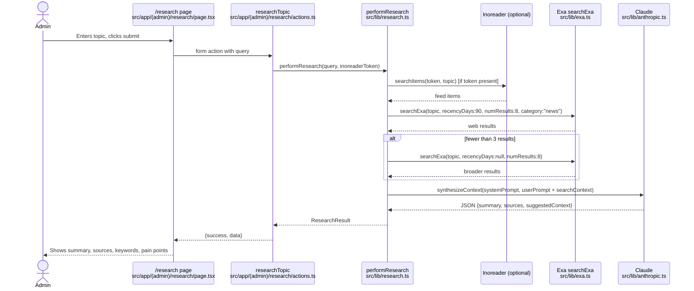
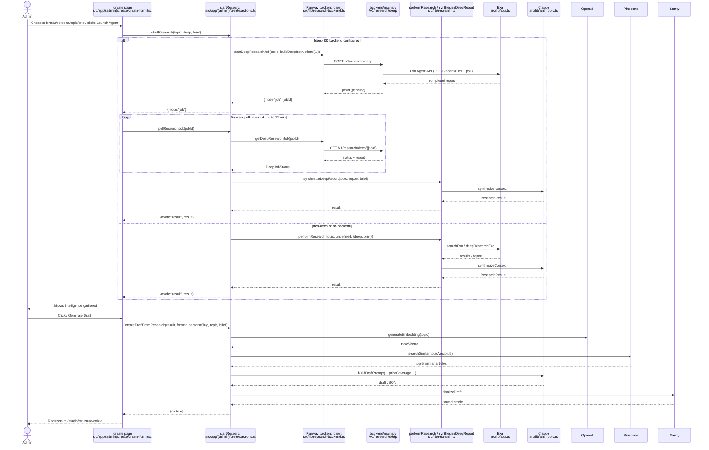

# Admin Research Workflow

This document describes what happens in the Silicon & Stone admin area when you press the **research** button. It covers the two admin pages that initiate research, the exact path through Exa and Pinecone, and where each external service is used.

> **Correction to the common assumption:** The research button itself does **not** use Pinecone. The research step is powered by **Exa** (fast web search or the Exa Agent API for Deep Dives). **Pinecone** is used *after* research, when you choose to generate a draft, to find semantically similar articles you have already written and inject them into the draft prompt as “prior coverage.” Pinecone is also the storage layer for the standalone `/knowledge` semantic-search workspace.

---

## 1. The two admin entry points

| Page | File | Button label | What it does |
|------|------|--------------|--------------|
| `/research` | `src/app/(admin)/research/page.tsx` | Arrow submit button (or Enter) | Runs a single research query and shows a forensic summary + sources. |
| `/create` | `src/app/(admin)/create/create-form.tsx` | **Launch Agent** | Runs research tailored to a chosen format/persona/topic/brief, then offers a **Generate Draft** button. |

Both pages are listed in the admin navigation in `src/app/(admin)/layout.tsx`.

---

## 2. High-level sequence: `/research`



### After `/research` — Create Draft (no Pinecone)

The `/research` page also renders a **Create Draft** button (`src/app/(admin)/research/draft-button.tsx`). When clicked:

1. It calls `createDraftFromResearch(summary, topic, sources)` in `src/app/(admin)/research/actions.ts`.
2. The sources are formatted as a simple text context block.
3. `buildDraftPrompt` is called with `personaKey: 'global-citizen'` and `format: 'signal'`.
4. Claude writes the draft.
5. `finalizeDraft` saves it to Sanity.

**This path does not query Pinecone.** It uses only the sources gathered by Exa/Inoreader as context.

---

## 3. High-level sequence: `/create`



---

## 4. Exa usage detail

Exa is wrapped in `src/lib/exa.ts`. There are two functions:

### `searchExa` — fast, recency-biased web search

Used for:
- Standard research on `/research`
- Non-deep formats on `/create` (Pulse, Signal, Guide, YouTube Script, Research Only)
- Fallback when deep research returns no results

Parameters (defaults):
```ts
{
  type: "auto",                // Exa picks neural vs keyword
  useAutoprompt: true,
  numResults: 8,               // capped at 10
  startPublishedDate: <90 days ago>,  // null disables recency bias
  category: "news",            // optional
  contents: {
    text: true,
    livecrawl: "fallback",     // fetch live page if index is stale
    highlights: { numSentences: 3, highlightsPerUrl: 1 }
  }
}
```

### `deepResearchExa` — agentic multi-step research

Used only for **Deep Dive** format (`format === "deep_dive"`).

> **Migrated 2026-08-13.** Exa retired the standalone Research API
> (`POST /research/v1`) in April 2026; it now answers `410 RESEARCH_RETIRED`.
> Deep Dives run on the **Exa Agent API** (`POST /agent/runs`) instead. Called
> via raw `fetch`/`httpx`, not the SDK: `exa-js` is pinned at 2.2.0 for the
> `/search` path and predates the `agent.runs` namespace.

```ts
// POST https://api.exa.ai/agent/runs
{
  query: instructions,   // built by buildDeepInstructions() — no separate
                         // `instructions` field on the Agent API
  effort: "high"         // minimal | low | medium | high | xhigh | auto
}
// -> { id, status: "queued" }
// Poll GET /agent/runs/{id} every 3s, up to 10 minutes.
// Terminal statuses: completed | failed | cancelled
// Report text:  output.text          (was output.content)
// Run cost:     costDollars.total
```

Do **not** add a `budget` object on a fixed-price effort tier — the API rejects
it with "budget is currently supported only for metered efforts". The tier is
the cost control.

The forensic prompt (`buildDeepInstructions` in `src/lib/research.ts`) instructs Exa to cover:
- Physical / supply-chain layer
- Regulatory layer
- Talent / capability layer
- Low/medium/high friction scenarios with Value-at-Stake figures
- Ground every claim in sources with figures, dates, named entities, and URLs

### Deep Dive infrastructure caveat

Deep research can run for minutes, which would exceed a Vercel serverless timeout. Therefore, when `BACKEND_API_URL` + `BACKEND_API_KEY` are configured:

1. `startResearch` in `src/app/(admin)/create/actions.ts` calls `startDeepResearchJob`.
2. That posts to the Railway backend: `POST /v1/research/deep` in `backend/main.py`.
3. The backend creates a job, stores state in Redis (or in-memory), and spawns `asyncio.create_task(_run_deep_research(...))`.
4. `_run_deep_research` calls the Exa Research API directly and polls every 3 seconds for up to 10 minutes.
5. The browser polls `pollResearchJob` every 4 seconds for up to 12 minutes.
6. When completed, `synthesizeDeepReport` runs Claude over the report and returns a `ResearchResult`.

If the backend is **not** configured, the deep path runs in-process via `deepResearchExa` in `src/lib/exa.ts`.

---

## 5. Pinecone usage detail

Pinecone is configured in `src/lib/pinecone.ts`. There are three indexes, one
per lane, deliberately not shared:

| Env var | Index | Purpose |
|---------|-------|---------|
| `PINECONE_INDEX_NAME` | `silicon-and-stone-articles` | Article-level semantic search (used for prior-coverage RAG and related articles) |
| `PINECONE_EVIDENCE_INDEX_NAME` | `silicon-and-stone-evidence` | Chunk-level evidence search (used in `/knowledge`) |
| `PINECONE_REGULATORY_INDEX_NAME` | `silicon-and-stone-regulatory` | Primary statutory text for drafting at `/create`; six instruments in namespace `PINECONE_REGULATORY_NAMESPACE`. Editorial only — never a Compliance Checker authority |

All three must be plain dense 1024-d cosine indexes with **no integrated `embed`
config**, because the app supplies its own OpenAI vectors. The retired
`silicon-and-stone` index violated this and still holds an unrelated `ideas`
namespace written by a tool outside this repo; do not reuse it.

### Prior-coverage RAG during draft generation

This is the moment Pinecone enters the research→draft workflow.

In `src/app/(admin)/create/actions.ts` → `createDraftFromResearch`:

```ts
const topicVector = await generateEmbedding(topic)
const similar = await searchSimilar(topicVector, 5)
if (similar.length > 0) {
  const lines = similar.map(
    (r) => `- "${r.metadata.title}": ${r.metadata.excerpt} (/analysis/${r.metadata.slug})`
  )
  priorCoverageBlock = `=== PRIOR COVERAGE IN YOUR KNOWLEDGE BASE ===\n...\n${lines.join('\n')}`
}
```

The `priorCoverageBlock` is passed to `buildDraftPrompt` and tells Claude: *“You have already written on related topics. Reference, extend, or differentiate from this prior work rather than repeating it.”*

If Pinecone is not configured, this step fails silently and the draft is generated without prior-coverage context.

### How articles get into Pinecone

Whenever an article is published or updated in Sanity, the webhook `POST /api/vectorize` fires (`src/app/api/vectorize/route.ts`):

1. Fetches the full article from Sanity.
2. Extracts article text via `extractArticleText` (`src/lib/embeddings.ts`).
3. Generates an embedding via `generateEmbedding` using OpenAI `text-embedding-3-small`, 1024 dimensions.
4. Upserts into Pinecone: `{ id: _id, values: vector, metadata }`.
5. Queries Pinecone for the 4 nearest neighbours and writes the top 3 back to the article’s `relatedArticles` field in Sanity (guarding against infinite webhook loops).

### Evidence index

`src/lib/evidence-index.ts` manages the evidence index:
- `replaceEvidenceSource(source)` deletes old chunks for a source and upserts new embedded chunks.
- `searchEvidence(vector, topK, filter)` queries the evidence index.

Used by `src/app/api/knowledge/evidence/route.ts` for the “Deep Evidence Search” in `/knowledge`.

### Semantic search API

`GET /api/search/semantic?q=...` embeds the query and calls `searchSimilar(vector, 10)` against the article index. This powers the “Published Article Search” in `/knowledge`.

---

## 6. Research result shape

Both paths return `ResearchResult` (defined in `src/types/research.ts`):

```ts
{
  summary: string
  sources: Array<{ title: string; url: string; snippet: string }>
  suggestedContext: {
    keywords: string[]
    pain_points: string[]
  }
  deepReport?: string   // only for Deep Dives
}
```

The JSON is produced by Claude in `synthesizeContext` (`src/lib/research.ts`) with a strict system prompt.

---

## 7. Embeddings

`src/lib/embeddings.ts` uses OpenAI `text-embedding-3-small` with 1024 dimensions.

```ts
export const EMBEDDING_MODEL = 'text-embedding-3-small'
export const EMBEDDING_DIMENSIONS = 1024
```

Input is capped at 24,000 characters to stay well under the ~8,191 token limit.

---

## 8. Key files and functions

| Purpose | File | Key export |
|---------|------|------------|
| Research page UI | `src/app/(admin)/research/page.tsx` | `ResearchPage` |
| Research page actions | `src/app/(admin)/research/actions.ts` | `researchTopic`, `createDraftFromResearch` |
| Create page UI | `src/app/(admin)/create/create-form.tsx` | `CreateForm` |
| Create page actions | `src/app/(admin)/create/actions.ts` | `startResearch`, `pollResearchJob`, `createDraftFromResearch` |
| Research orchestration | `src/lib/research.ts` | `performResearch`, `buildDeepInstructions`, `synthesizeContext`, `synthesizeDeepReport` |
| Exa client | `src/lib/exa.ts` | `searchExa`, `deepResearchExa` |
| Railway backend client | `src/lib/research-backend.ts` | `isBackendConfigured`, `startDeepResearchJob`, `getDeepResearchJob` |
| Embeddings | `src/lib/embeddings.ts` | `generateEmbedding`, `extractArticleText`, `buildArticleMetadata` |
| Pinecone client/article search | `src/lib/pinecone.ts` | `getPineconeIndex`, `searchSimilar` |
| Evidence index | `src/lib/evidence-index.ts` | `replaceEvidenceSource`, `searchEvidence` |
| Article vectorize webhook | `src/app/api/vectorize/route.ts` | `POST` handler |
| Semantic search API | `src/app/api/search/semantic/route.ts` | `GET` handler |
| Evidence search API | `src/app/api/knowledge/evidence/route.ts` | `GET` handler |
| Railway deep-research API | `backend/main.py` | `start_deep_research`, `get_deep_research`, `_run_deep_research` |
| Types | `src/types/research.ts` | `ResearchResult`, `ResearchSource` |

---

## 9. Required environment variables

| Variable | Used by | Purpose |
|----------|---------|---------|
| `EXA_API_KEY` | `src/lib/exa.ts` | Exa web search / deep research |
| `OPENAI_API_KEY` | `src/lib/embeddings.ts` | Generate embeddings |
| `PINECONE_API_KEY` | `src/lib/pinecone.ts` | Pinecone client |
| `PINECONE_INDEX_NAME` | `src/lib/pinecone.ts` | Article semantic-search index |
| `PINECONE_EVIDENCE_INDEX_NAME` | `src/lib/pinecone.ts` | Evidence chunk index |
| `PINECONE_REGULATORY_INDEX_NAME` | `src/lib/pinecone.ts` | Statutory corpus index — the lane no-ops silently if unset |
| `PINECONE_REGULATORY_NAMESPACE` | `src/lib/pinecone.ts` | Corpus version namespace (currently `v2026-08-13`) |
| `BACKEND_API_URL` | `src/lib/research-backend.ts` | Railway backend base URL (optional) |
| `BACKEND_API_KEY` | `src/lib/research-backend.ts` | Shared secret with backend (optional) |
| `ANTHROPIC_API_KEY` | `src/lib/anthropic.ts` | Claude synthesis / draft writing |
| `SANITY_API_WRITE_TOKEN` | `finalizeDraft`, vectorize webhook | Write drafts and related articles |
| `SANITY_WEBHOOK_SECRET` | `src/app/api/vectorize/route.ts` | Verify Sanity webhook |

---

## 10. Summary

1. **Research is always Exa.** The button triggers either a fast Exa search (`searchExa`) or, for Deep Dives, the Exa Agent API (`deepResearchExa`), optionally routed through the Railway backend.
2. **Claude synthesizes** the Exa/Inoreader output into a `ResearchResult` (summary, sources, keywords, pain points).
3. **Pinecone is used only when generating a draft** from the `/create` page. It retrieves up to 5 similar prior articles and feeds them to Claude as prior-coverage context.
4. **Pinecone is also populated** by the `/api/vectorize` webhook whenever Sanity publishes/updates an article, and it powers the standalone `/knowledge` semantic search workspace.
